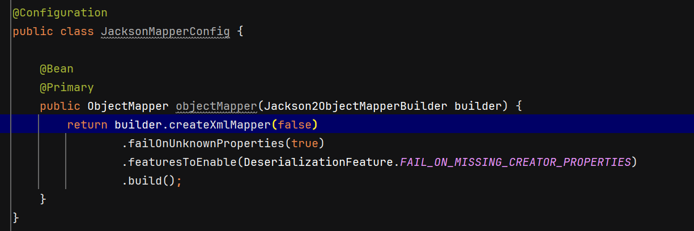
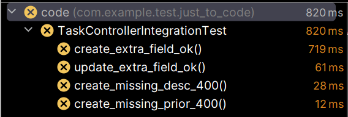
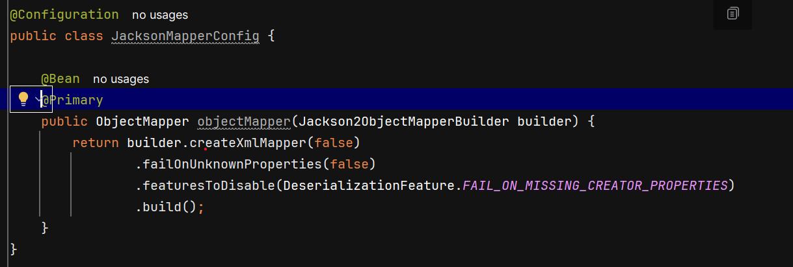
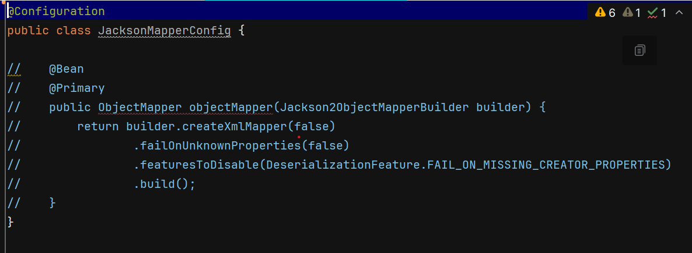
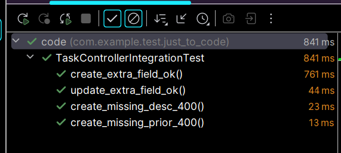

# Error on Exam caused by ObjectMapper Bean Properties

## 🆘 About this possibility

This possibility shows how overridden (Jackson) beans might affect the response and usability of an API.

### ❌ What does it affect

- This changes how Spring and Jackson Framework manipulate the income content
- Here was changes the response of this application for:
    - Missing content field (note: not empty or null field, but non-informed field)
    - Extra field on content (note: a field that was not read by the application at all)
- The we might have two results, depending on the properties are or or off (true or false)
    - On: This content is reject during the content reading (deserialization)
    - Off: If it is a extra field, just ignore it. If, it is a missing field, set the DTO property as null.

### 👀 Testing this case

#### Properties on:

Jackson ObjectMapper config overrides the properties:

```properties
DeserializationFeature.FAIL_ON_UNKNOWN_PROPERTIES
DeserializationFeature.FAIL_ON_MISSING_CREATOR_PROPERTIES
```

Spring does the same as the with:

```properties
spring.jackson.deserialization.fail-on-unknown-properties
spring.jackson.deserialization.fail-on-missing-creator-properties
```

For this configuration we used the `Jackson2ObjectMapperBuilder`, but there are others ways to change theses configs when creating `ObjectMapper` Bean:

```Java
buider.failOnUnknownProperties(true);
buider.featuresToDisable(DeserializationFeature.FAIL_ON_MISSING_CREATOR_PROPERTIES)
```

Integrated tests for those cases:
- ***create_extra_field_ok***: Create Task with extra field and expect 201
- ***update_extra_field_ok***: Create Task with extra field and expect 200
- ***create_missing_desc_400***: Create Task with missing description field and expect 400 with specific message
- ***create_missing_prior_400***: Create Task with missing priority field and expect 400 with specific message

#### Properties on:

Setting ObjectMapper Bean on test case:


Tests result for those cases:



#### Properties off:

Setting ObjectMapper Bean on test case:



❗ This is the default configuration of the ObjectMapper, so you might just remove the specific config for the project:



Tests result for those cases:



## 🛠️ Technology Stack

- **Spring Boot 3.5.16** - Framework
- **Spring Data JPA** - Data access
- **H2 Database** - In-memory database
- **JUnit 5** - Testing framework
- **Mockito** - Mocking library
- **Maven** - Build tool
- **Java 21** - Programming language

## 📝 What This Repository Demonstrates

This POC playground includes examples of:

- ✅ Just simulate an Exam where JSON parser fails when missing properties


## 🎓 Learning Resources for References

### That Hardcoded Deterministic Exams are worthless

- The global software engineering community largely agrees that Codility and similar platforms are poor tools for evaluating high-level professionals (Senior, Staff, and Principal engineers).
- They fail significantly when it comes to measuring the maturity of an experienced engineer.

### When to use Hardcoded Deterministic

- they are excellent for screening thousands of junior candidates during the initial stages

### Why Hardcoded Deterministic fails for Senior and above

- Focus on Rote Memorization of Algorithms, Commands and Expressions. While does not validate real life expertise like Correct usage of possible solutions, high level patterns application and decisions, ability to choose or use architecture and engineering possibilities, and others.
- There is a lack of context regarding how they are applied as solutions, given that these exams focus on solving problems in pre-established ways, without allowing for analysis.
- These exams tend to obscure a significant part of the design, configuration, engineer and tests aspects of the projects and apps, making high-level professionals uncomfortable, as they are accustomed to analyzing every possible context.
- Highly qualified professionals often fail because these concepts are not part of their day-to-day work. Topics such as highly specific algorithm theory, bitwise operations, and the like are geared toward academia and are rarely used in real-world contexts. Furthermore, the testing format—featuring tight time limits and unrealistic pacing—can make these professionals uncomfortable during the exam, given that they have (most likely) been away from that academic environment for years.

## 📋 Overview

- As we don´t access for all properties and config, it hard to know what might happens in complex scenario like running a fully working spring API
- High level professional will not does deliver a code, but a fully developed software. So all possible config and aspects must be well-informed.
- This branch has a goal to understand what was happan on the exam e simulate it. So it maight prove that this kind of exam a terrible.

## 🎯 Project Aim

- 🔄 This case is just to prove erros on a specific exam.

### Prerequisites

- **Java 21+**
- **Maven 3.9+**
- **Spring Boot 3.5.16**

### Build & Run

```bash
# Clone the repository
git clone https://github.com/rcoelho6/just_to_code.git
cd just-to-code

# Build the project
mvn clean install

# Run the application
mvn spring-boot:run
```

The API will be available at `http://localhost:8080`

## 📚 Current POCs & Modules

### Example: Task Management Module

This project includes a **Task Management module** as an example implementation demonstrating RESTful API design and CRUD operations.

**Endpoints:**
- **POST** `/tasks` - Create a new task
- **PUT** `/tasks/{id}` - Update an existing task
- 🔨`[To Be Implemented]`**GET** `/tasks/{id}` - Retrieve a specific task
- 🔨`[To Be Implemented]`**DELETE** `/tasks/{id}` - Delete a task

**Request Body Example:**
```json
{
  "description": "Hey, look this! It has a branch for clean arch impl!",
  "priority": 9999
}
```

**Error Response Example:**
```json
{
  "message": "Oh God! No! No! Nooo!",
  "status": 404
}
```

Feel free to add more modules and POCs to this project!

## 🧪 Testing

Run the test suite:

```bash
mvn test
```

Tests are written using:
- **JUnit 5** - Test framework
- **Mockito** - Mocking framework
- **Spring Test** - Spring Boot testing utilities

### Adding a New POC

```bash
# 1. Create a feature branch
git checkout -b feat/your-poc-name

# 2. Create a new module/package
mkdir -p src/main/java/com/example/test/just_to_code/yourpoc

# 3. Implement your POC
# 4. Add tests
# 5. Document your findings
# 6. Commit and push
git commit -m "feat: Add [Your POC Name] proof of concept"
git push origin feat/your-poc-name
```

## 📖 Git Workflow

```bash
# Create a new feature branch
git checkout -b feat/new-concept

# Make your changes and commit
git add .
git commit -m "Add new POC or example"

# Push to repository
git push origin feat/new-concept

# Compare with other branches
git diff main feat/new-concept
```

## ❓ FAQ

**Q: Can I use this in production?**  
A: This is a learning/POC project. For production use, ensure proper security, validation, and error handling are implemented.

**Q: How do I compare different architectures?**  
A: Use `git diff` to compare the `main` branch with `feat/clean-arch` to see different implementation approaches for the same API.

**Q: Where should I add new experiments?**  
A: Create a feature branch (`feat/your-experiment-name`) to keep experiments organized and isolated.

## 📄 License

This project is open source and available under the MIT License.

## 👤 Author

Created as a reference implementation and POC playground by the development team.

---

**Happy coding! This repository is your sandbox for learning and experimentation. 🎉**
